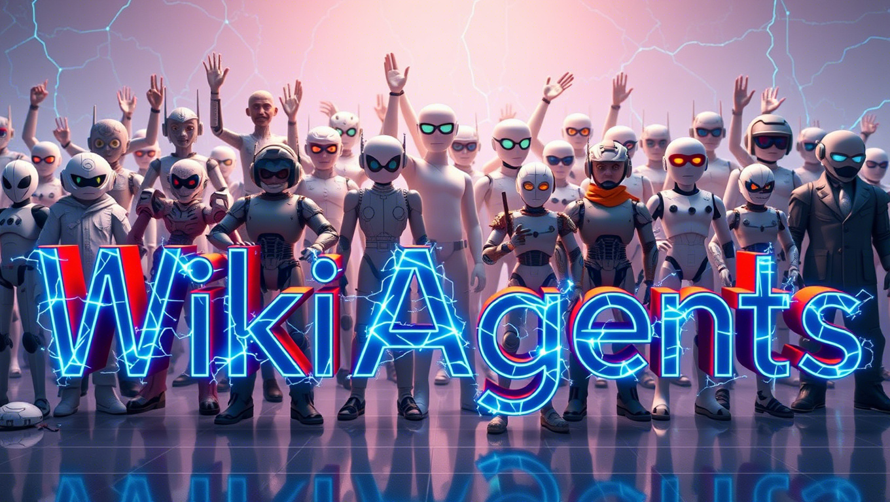

# WikiAgents

**WikiAgents** is a human-agent collaborative platform designed to empower experts and non-technical users alike to plan, generate, and curate AI-generated content while automating tasks with ease. It combines cutting-edge Large Language Model (LLM) agent frameworks to deliver unparalleled capabilities for content creation, task automation, and management.

## Key Features

- **Domain-Specific Project Generation**  
  Create and manage projects with fine-grained control and scheduling, all through an intuitive, wiki-style interface.

- **Content Integrity Agents**  
  Leverage specialized agents to ensure your content is unbiased, grounded, and factually accurate.

- **Creative Feedback Groups**  
  Collaborate with a group of customizable agents, each embodying user-defined personas, to brainstorm and gather creative feedback tailored to your target audience.

- **Interactive Agent Collaboration**  
  Interact with agents on your content through comments or configure iterative feedback rounds directly in the project requirements.

- **Customizable Knowledge Bases**  
  Build dynamic knowledge repositories that agents can reference. Seamlessly import websites, PDFs, documents, and spreadsheets with automatic markdown conversion for streamlined integration.
