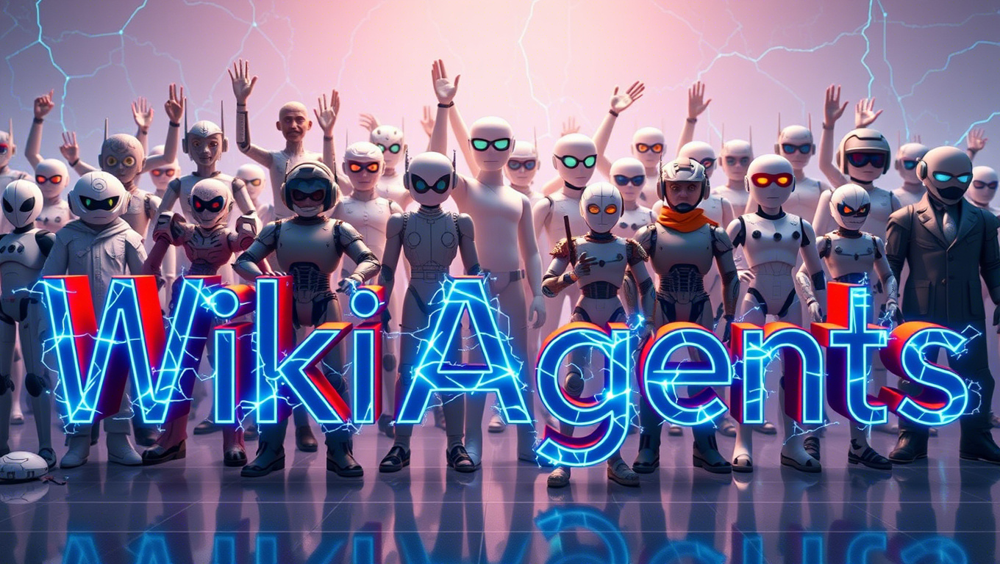

**WikiAgents** is a human-agent collaborative platform that empowers both technical and non-technical users to plan, generate, refine, and manage AI-generated content while automating tasks with ease. Built on advanced Large Language Model (LLM) agent frameworks, WikiAgents offers a powerful and flexible solution for content creation, verification, and iterative refinement.

## Key Features

- **Domain-Specific Project Generation**  
  Users provide a brief description of their goal, and WikiAgents automatically suggests a tailored project structure, including recommended agents, tools and requirements. Users can further refine the project, adjust settings, and start the generation process with minimal effort.

- **Content & Task Agents**  
  WikiAgents includes predefined agents for general content generation and task-solving. These agents can coordinate with each other to manage complex workflows. Users can also customize or integrate their own agents by creating dedicated agent pages to suit specific project needs.

- **Customizable Tools**  
  WikiAgents allows users to create custom tools for agents to solve specific tasks. These tools can be easily added and configured through dedicated tool pages in the platform, enabling tailored workflows and expanded agent capabilities.

- **Content Integrity Agents**  
  Ensure content is unbiased, grounded, and factually accurate with specialized agents such as fact-checkers, bias scanners, and groundedness verifiers. These agents work seamlessly to maintain content quality and credibility.

- **Creative Feedback Agents**  
  Collaborate with customizable agents, each embodying user-defined personas, to brainstorm and gather tailored creative feedback. Set specific goals for brainstorming sessions and trigger feedback rounds through simple commands or project configurations.

- **Customizable Knowledge Bases**  
  Build dynamic knowledge repositories that agents can reference for content generation and verification. Import documents (websites, PDFs, spreadsheets) and automatically convert them to markdown for easy integration into your projects. Websites can also be periodically checked and transcribed to ensure the knowledge base stays up-to-date.

- **Agent Collaboration and Transparency**  
  Collaborate seamlessly with agents through comments, providing real-time input and feedback. Every agent interaction and project generation step is logged in **Tapes**, which store detailed records of decisions, actions, and feedback. These logs are stored in each project's metadata, ensuring full transparency and easy tracking of the agent’s thought process and decisions.

## Key Benefits

- **Seamless Collaboration**  
  Empower teams to collaborate more effectively by integrating human creativity and AI-driven automation into every step of content development and refinement.

- **End-to-End Content Management**  
  From generation and verification to refinement and iteration, WikiAgents provides a unified platform for comprehensive content management.

- **Extensible and User-Focused**  
  WikiAgents is highly customizable, allowing users to create their own agents, tools, and workflows that align with specific project needs.

## Potential Applications

- **Academic Research Collaboration**  
  Facilitate collaborative research by enabling the development, testing, and refinement of custom LLM agents for generating, refining, and verifying content.

- **Knowledge Management & Content Curation**  
  Efficiently create, curate, and manage content across various domains and platforms, ensuring consistency and ease of maintenance.

- **Dynamic Document Creation**  
  Automatically generate and update complex documents, reports, and manuals, leveraging real-time collaboration and agent-driven processes.

- **Content Verification for News & Technical Writing**  
  Automatically verify facts, check for bias, and ensure groundedness, making content creation more reliable and credible.
