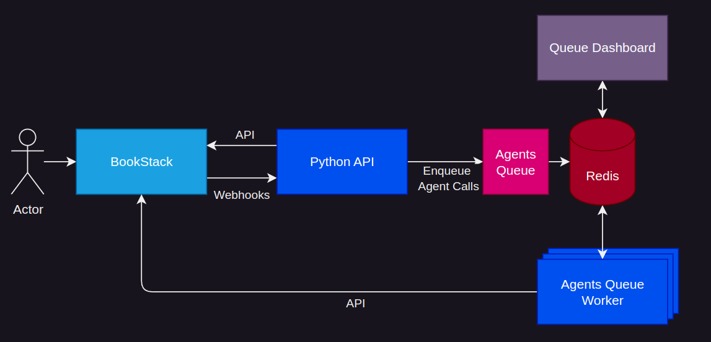

[](https://www.youtube.com/watch?v=oOgGAfakdng)

**WikiAgents** is a platform where humans and AI agents work together to simplify **Content Ideation**, **Generation**, **Verification**, and **General Agent Automation**. Built on the reliable and feature-rich **BookStack** platform, WikiAgents combines the flexibility of a wiki interface with advanced Large Language Model (LLM) agents to deliver a seamless experience.

Designed for both technical and non-technical users, WikiAgents makes it easy to tackle everything from generating detailed reports to verifying facts, brainstorming ideas, managing knowledge and automating workflows — all in one unified platform.

## Key Features

- **Agentic Content Generation**  
  Users provide a brief description of their goal, and WikiAgents suggests a tailored project structure, including recommended agents, tools, requirements and more, all through an agentic requirements wizard. Users can make changes at each step and review the agents' decisions on the Tape page.

- **Content & Task Agents**  
  WikiAgents includes predefined agents for general content generation and task-solving. The project agent coordinates these agents to manage complex workflows. Users can also customize or integrate their own agents by creating dedicated agent pages to suit specific project needs.

- **Customizable Tools**  
  WikiAgents allows users to create custom tools for agents to solve specific tasks. These tools can be easily added and configured through dedicated tool pages in the platform, enabling tailored workflows and expanded agent capabilities.

- **Content Integrity Agents**  
  Ensure content is unbiased, grounded*, and factually accurate* with specialized agents such as fact-checkers*, bias scanners, and groundedness verifiers*. *Not implemented yet.

- **Creative Feedback Agents**  
  Collaborate with customizable agents, each embodying user-defined personas, to brainstorm and gather tailored creative feedback. Set specific goals for brainstorming sessions and trigger feedback rounds through simple commands or project configurations.

- **Customizable Knowledge Bases**  
  Build knowledge repositories that agents can reference for content generation and verification. Import documents (websites, PDFs, spreadsheets) and automatically convert them to markdown for easy integration into your projects. Websites can be periodically checked and transcribed to ensure the knowledge base stays up-to-date.

- **Agent Interaction and Transparency**  
  Interact with agents through comments, get simple feedback or trigger complex workflows. Every agent interaction and project generation step is logged in **Tapes**, which store detailed records of decisions, actions, and feedback. These logs are stored in each project's metadata, ensuring full transparency and easy tracking of the agent’s thought process and decisions.


## Key Benefits

- **Seamless Human & Agent Collaboration**  
  Enable both teams and individuals to collaborate effortlessly with LLM agents, blending human creativity with AI-driven automation at every stage of content development and refinement. Whether working independently or within a team, users can interact with agents to enhance productivity and streamline workflows.

- **End-to-End Content Management**  
  From generation and verification to refinement and iteration, WikiAgents provides a unified platform for comprehensive content management.

- **Extensible and User-Focused**  
  WikiAgents is highly customizable, allowing users to create their own agents, tools, and workflows that align with specific project needs.

## Potential Applications

- **LLM Agents Education**   
  WikiAgents simplifies user education on Large Language Model (LLM) agents with intuitive customization options, enabling experimentation and learning. Transparency features like Tapes log detailed records of agent decisions and interactions, offering valuable insights into their thought processes.

- **Personal Research & Task Automation**   
  Use WikiAgents as a personal platform for automating research tasks, managing knowledge, and streamlining workflows tailored to individual needs.

- **Academic Research Collaboration**  
  Facilitate collaborative research by enabling the development, testing, and refinement of custom LLM agents for generating, refining, and verifying content or automating complex workflows.

- **Many more**


## Usage

To get started with WikiAgents, follow these steps:

1. **Clone the GitHub Repository**  
   First, clone the repository to your local machine:
   ```bash
   git clone https://github.com/WikiAgents/WikiAgents.git
   ```

2. **Navigate to the Project Directory**  
   Move into the project directory:
   ```bash
   cd WikiAgents
   ```

3. **Set Up the Environment**  
   Before running the application, set your **OpenAI API Key** in the `.env` file:  
   - Open the `.env` file located in the root directory.  
   - Add your OpenAI API Key as follows:
     ```
     OPENAI_API_KEY=your-api-key-here
     ```

4. **Generate API Keys**  
   Run the key generator script to generate unique API keys for the application:
   ```bash
   # TODO (will use default keys for now)
   ```

5. **Start the Application with Docker**  
   Bring up the containers using Docker Compose:
   ```bash
   docker compose up -d
   ```

6. **Access the Application**  
   Once the containers are running, open your browser and navigate to:
   ```
   http://localhost:6875
   ```

7. **Login with Default Credentials**  
   Use the default credentials to log in to the application:  
   - **Email:** `admin@admin.com`  
   - **Password:** `password`  

8. **Stop and Manage the Application**  
   - To stop the application, use the following command:  
     ```bash
     docker compose down
     ```
   - To stop the application and delete all data:  
     ```bash
     docker compose down -v
     ```

### Additional URLs:
- **Main Application:** [http://localhost:6875](http://localhost:6875)  
- **Queue Dashboard:** [http://localhost:9181](http://localhost:9181)  
- **phpMyAdmin:** [http://localhost:8001](http://localhost:8001)  
- **Redis Insight:** [http://localhost:5540](http://localhost:5540)  

## Guides
Check out the [User Guide](docs/userguide.pdf)

## Architecture Overview




## Acknowledgements

- **Built on top of [BookStack](https://www.bookstackapp.com/)**: An exceptional open-source platform for organizing and managing documents. Its flexibility, user-friendly design and feature-completeness were key to the success of this project.
- **Powered by [TapeAgents](https://github.com/ServiceNow/TapeAgents)**, an agent framework provided by [ServiceNow](https://www.servicenow.com/), enabling advanced agent functionalities and transparency.
- **Developed during the [LLM Agents Hackathon](https://rdi.berkeley.edu/llm-agents-hackathon/)** hosted by [Berkeley RDI](https://rdi.berkeley.edu/), which provided the perfect framework and motivation for this project.
- **Supported by the [LLM Agent MOOC](https://llmagents-learning.org/f24)** offered by [Berkeley RDI](https://rdi.berkeley.edu/), enriching my understanding of LLM agents and their capabilities.
- **Enabled by [OpenAI](https://openai.com/) and [ChatGPT](https://chatgpt.com/)**, which served as an invaluable virtual collaborator, contributing to idea refinement, enabling rapid development and documentation, and powering the LLM backend through API integration.
- This project makes use of methodologies and ideas from various research papers, including:   

  Bahdanau, Dzmitry, Nicolas Gontier, Gabriel Huang, Ehsan Kamalloo, Rafael Pardinas, Alexandre Piche, Torsten Scholak, Oleh Shliazhko, Jordan Prince Tremblay, Karam Ghanem, Soham Parikh, Mitul Tiwari, and Quaizar Vohra. **"TapeAgents: a Holistic Framework for Agent Development and Optimization."**
  [Read here](https://www.servicenow.com/research/TapeAgentsFramework.pdf)

  Salem, Paulo, Christopher Olsen, Paulo Freire, Yi Ding, and Prerit Saxena. **"TinyTroupe: LLM-powered multiagent persona simulation for imagination enhancement and business insights."**  
  *GitHub repository* (2024). [Read here](https://github.com/microsoft/tinytroupe).  

  Menzner, Tim, and Jochen L. Leidner. **"BiasScanner: Automatic Detection and Classification of News Bias to Strengthen Democracy."**  
  *arXiv preprint arXiv:2407.10829* (2024). [Read here](https://arxiv.org/abs/2407.10829).

  Deep Search Team. **"Docling Technical Report."**  
  *arXiv preprint arXiv:2408.09869* (2024). [Read here](https://arxiv.org/abs/2408.09869).  


## Disclaimer

- This project is provided **"as is"** without any warranty of any kind, either express or implied, including but not limited to the warranties of merchantability, fitness for a particular purpose, or non-infringement.
- The author is not responsible for any costs associated with the use of APIs or other external services integrated into this project.
- All **LLM agent personas** in this project are entirely **fictional** and have no relation to any real-world individuals, entities, or organizations. Any resemblance to actual persons is purely coincidental.


## Known Limitations

- **Page Refresh Mechanism**: The current page refresh mechanism is not yet optimized and may be heavy on bandwidth. This could result in higher data usage or slower performance in some cases. Improvements to make this process more efficient are planned for future updates.

- **Renaming Agent & Tool Pages**: Renaming agent and tools pages is not supported right now and may lead to unexpected results. Users are advised to recreate these pages instead of renaming them to avoid issues.

- **Unique Page Names**: Agent page names and page names within a project must be unique to prevent ambiguity and ensure proper functionality. Avoid using duplicate names for different pages.
